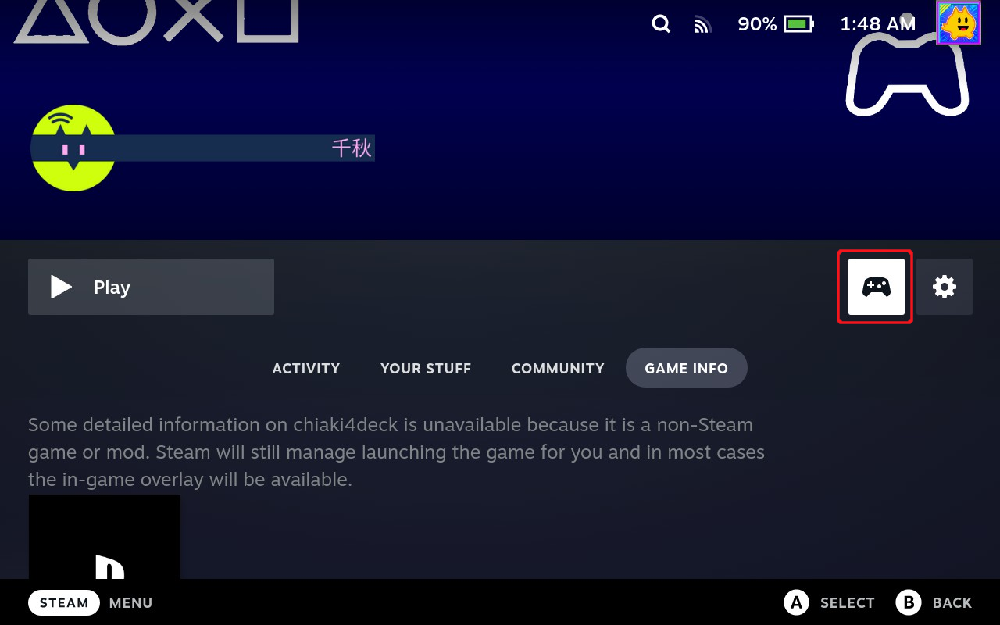
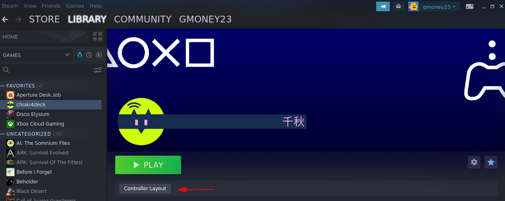
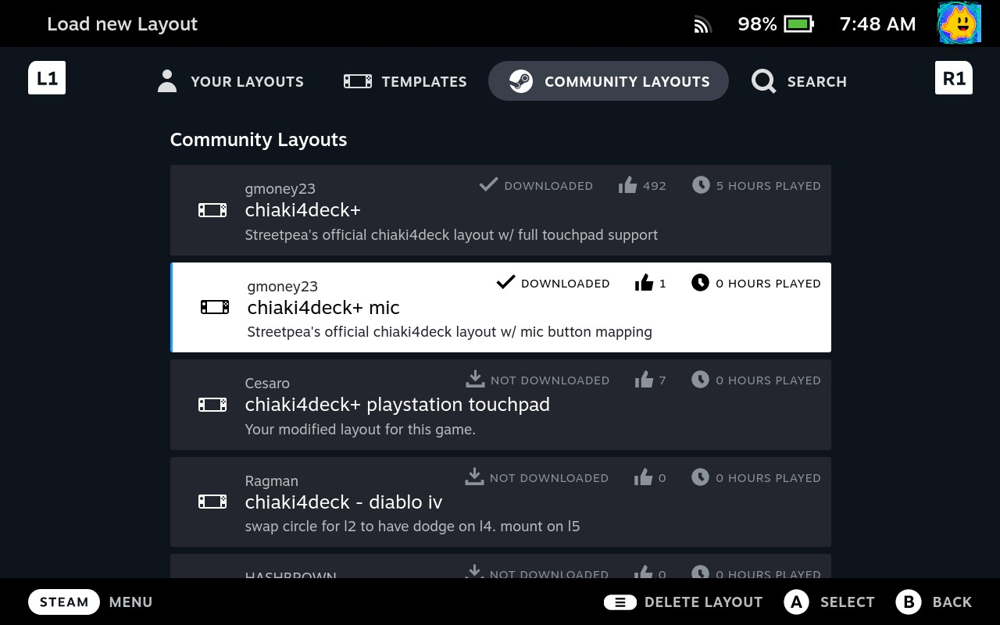
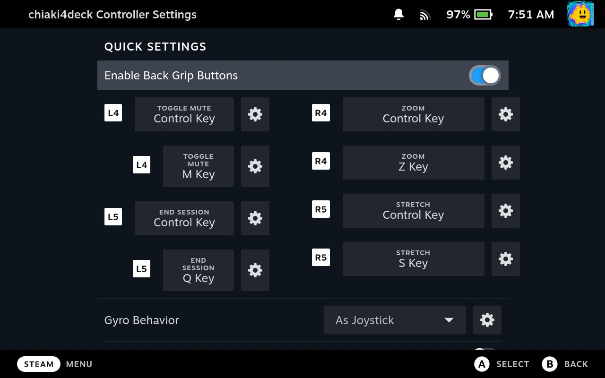
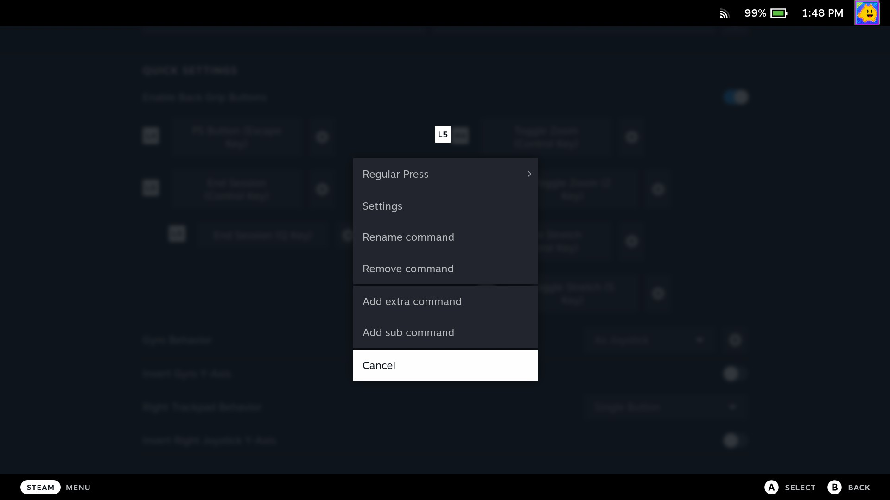

# Configuring Steam Deck Controller Profile

Get all of the shortcuts mapped to Steam Deck controls. Start by going to the `chiaki4deck` game menu and selecting the controller layout to configure controller options.

=== "Game Mode"

    

=== "Desktop Mode"

    

## Default Controller Profile

The easiest way to configure all of the necessary shortcuts for `chiaki4deck` is to copy the profile I have created in the `COMMUNITY LAYOUTS` tab. 

1. Click the current layout box (it says: *Browse Community Layouts for games without official controller support* underneath it).

2. Move to the `COMMUNITY LAYOUTS` tab and select `chiaki4deck` by `gmoney23`

    

### Default `chiaki4deck` Layout Mapping Full View

### Default `chiaki4deck` Layout Trackpad Mapping

I have mapped the trackpads as single buttons triggered when you press them down.  The left trackpad is the PlayStation button and the right trackpad is a PlayStation controller touchpad click.

### Default `chiaki4deck` Layout Back Button Mapping

I have mapped L4 to the PlayStation button, L5 to end session (++ctrl+q++), R4 to zoom (++ctrl+z++), and R5 to stretch (++ctrl+s++).

### Default `chiaki4deck` Layout Gyro Mapping

I have also mapped gyro controls `As joystick`. Whenever you touch the right joystick or trackpad, you can move the Steam Deck to aim / control the camera with motion (gyro) controls in addition to moving the right joystick. You can always change this by choosing to edit the layout and going into the gyro settings.

## Creating your Own Controller Profile

You can create your own controller profile by mapping the relevant buttons. The [special button mappings](#special-button-mappings-you-need-to-assign-these-yourself) (functions not assigned to the controller by default) [set these] and the [standard button mappings](#standard-button-mappings-these-directly-map-and-dont-need-to-be-specifically-set) (controls that directly map and are thus assigned by default) [no need to set these unless you prefer different mappings] are listed in tables below for your convenience.

### Special Button Mappings (You need to assign these yourself)

| Function | Button | Description                                                                 |
| ---------|--------|-----------------------------------------------------------------------------|
| `Quit`   |  ++ctrl+q++ | Close `chiaki4deck` cleanly, putting console in sleep mode if desired  |
| `Zoom`   |  ++ctrl+z++ | Toggle between zoom (zoomed in to eliminate borders, cutting off edge of screen) and non-zoom (black borders) |
| `Stretch`| ++ctrl+s++  | Toggle between stretch (stretched to eliminate borders, distorting aspect ratio of image), and non-stretch (black borders with default aspect ratio) |
| `PlayStation Button`| ++esc++ | The PlayStation / home button as it normally functions on a PlayStation controller |
| `Share Button` | ++f++ | The Share button on the PS5 controller used for taking screenshots, videos, etc. stored on your PS5 and uploaded to the PlayStation app on your phone if you so choose. |

!!! Tip "Two Button Shortcuts"

    If you want to create a shortcut that includes 2 buttons like ++ctrl+q++, add the first key (i.e. ++ctrl++) and then click the gear icon to the right of the added command (i.e. ++ctrl++) and select `Add sub command`. Finally, fill in the new blank rectangle that appears with the desired second key (i.e. ++q++)

    

### Standard Button Mappings (These directly map and don't need to be specifically set)

| Function         | Button                  |
|------------------| ------------------------|
| `right joystick` | `right joystick`        |
| `left joystick`  | `left joystick`         |
| `dpad up`        | `dpad up`               |
| `dpad left`      | `dpad left`             |
| `dpad down`      | `dpad down`             |
| `dpad right`     | `dpad right`            |
| `start button`   | `option button`         |
| `triangle`       | `Y button`              |
| `square`         | `X button`              |
| `cross`          | `A button`              |
| `circle`         | `B button`              |
| `R1`             | `R1`                    |
| `R2`             | `R2`                    |
| `R3`             | `R3` (right-stick click)|
| `L1`             | `L1`                    |
| `L2`             | `L2`                    |
| `L3`             | `L3` (left-stick click) |

### Gyro and Touch Controls

!!! Notice "Native Touchpad Gesture and Gyro Support"

    As of now, gyro and touch controls (other than the touchpad click) do not directly map for games that support those (i.e. Ghost of Tsushima for touch gesture and Concrete genie for gyro controls). In order to get around this, you can remap controls in accessibility options if the specific game supports that. In the future, I plan to update `chiaki4deck` to support this for the DualSense / DualShock 4 controllers (the code supports this, but I need to create instructions for the flatpak) and the Steam Deck controller (requires further code changes). This affects a small subset of games. However, it is important to note when thinking of which games to play with Chiaki/`chiaki4deck`.

Additionally, you can use gyro controls for camera options with any game (with gyro in the game itself turned off) by mapping gyro `As joystick` and adding a condition for when it's used (i.e. `On` with a condition of `right touchpad or right joystick touch`) in the gyro settings for `chiaki4deck`. I have done this in the [default `chiaki4deck` control setting](#default-chiaki4deck-layout-mapping-full-view) and you can do it in your custom control scheme.